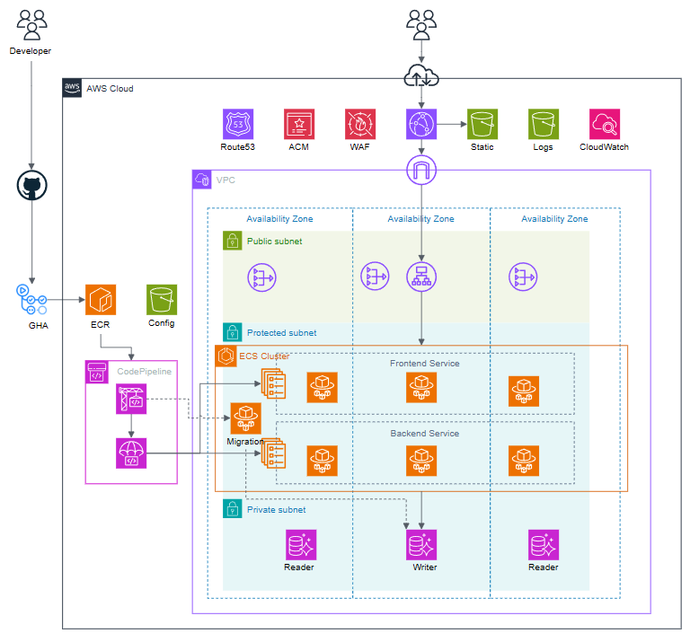

# CDK Projects

このリポジトリでは、AWS CDK を使って構築したインフラのコードを管理する

構成図は[こちら](https://drive.google.com/file/d/1kTUqcHyjaa7K3S4n2hXqkF0ctkljaSqb/view?usp=sharing)

## ユースケース
### 1. ECS on Fargate 構成の Web アプリケーション

